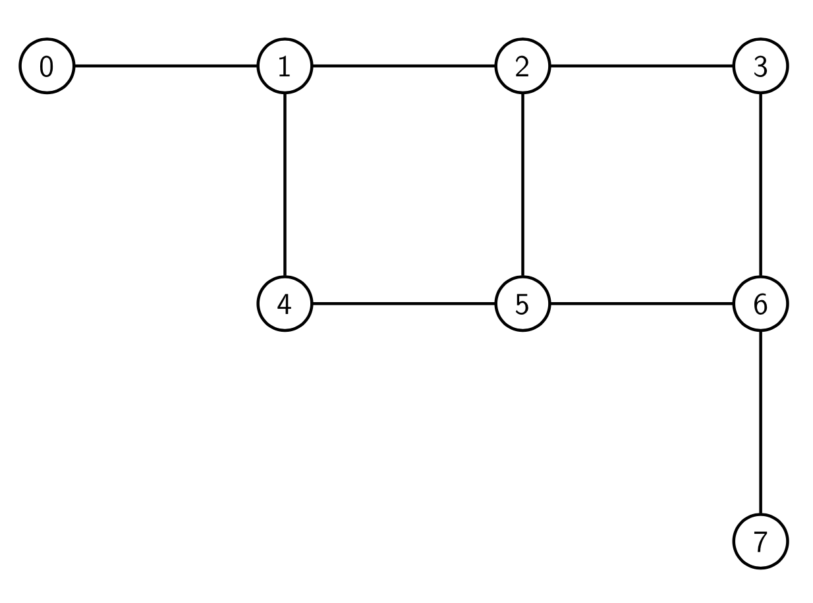

=============
Graph Mapping 
=============

To start this exercise, we'll look at a complete Ocean program that uses the
package ``dwave-networkx``.  D-Wave NetworkX is an extension of NetworkX—a
Python language package for exploration and analysis of networks and network
algorithms—for users of D-Wave Systems.  The base problem of this exercise is
the antenna selection problem from the `D-Wave Collection of Examples
<https://github.com/dwave-examples/antenna-selection>`_.

Exercise 1 
----------

Enter your token on line 27 and run ``original_program.py``.  Read through the 
code and take a look at the structure of the program.  In particular, pay 
attention to:

- How are we creating the graph structure?
- How are we defining and calling our sampler?

Exercise 2 
----------

Open ``change_sampler.py``.  This file is identical to ``original_program.py``,
but does not have a sampler defined.  Set up your sampler in the ``set_sampler`` 
function to run the simulated annealing algorithm.

Note:  Don't forget to import the package where the sampler lives.  You may find
the `Ocean documentation <docs.ocean.dwavesys.com>`_ useful.

Exercise 3 
----------

Open ``change_problem.py``.  This file is identical to ``original_program.py``,
but is missing the following things:  (1) a graph definition, and (2) a graph
algorithm from dwave-networkx.  Fill in the functions ``create_graph`` and 
``solve_problem`` in this program to solve the minimum vertex cover on the 
following graph.  You will also need to input your token at the start of the
program.

